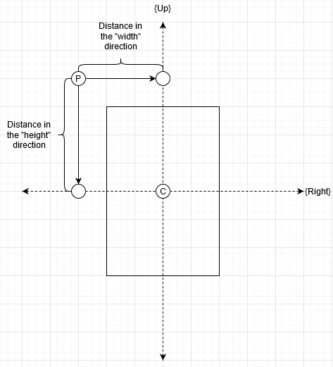

# RaytracerJS
Simple raytracer written in javascript

## TODO
- Plane texture
- Reflection
- Shadows
- Refraction
- And more.. 
#### Debug in VScode with Firefox developer edition: 
1. Install [Debugger for Firefox](https://marketplace.visualstudio.com/items?itemName=firefox-devtools.vscode-firefox-debug)
2. Either create your own `launch.json` or use mine (`.vscode/launch.json`)
3. Configure Firefox to allow remote debugging, or use Firefox Developer Edition
4. Run Firefox with remote debugging:
###### Powershell
```powershell
Start-Process "C:\Program Files\Firefox Developer Edition\firefox.exe" -ArgumentList "-start-debugger-server"
```

## Math
#### This is all temporary, will write a more detailed wiki for this project later
* [Ray calculation](https://en.wikipedia.org/wiki/Ray_tracing_(graphics)#Calculate_rays_for_rectangular_viewport)
* [Ray-sphere inersection](https://en.wikipedia.org/wiki/Ray_tracing_(graphics)#Example)
* [Phong reflection model](https://en.wikipedia.org/wiki/Phong_reflection_model)
* [Ray-plane intersection](https://www.scratchapixel.com/lessons/3d-basic-rendering/minimal-ray-tracer-rendering-simple-shapes/ray-plane-and-ray-disk-intersection)
* Ray-plane boundaries are done through the following image, where P is a point on the plane according to the planes equation, then I use the Up and Right vectors of the plane to calculate whether the point is inside the created boundaries, consisting of the width and the height of the plane. For the Up length, i send a ray from P, in the direction of Right, and do a line-line intersection with the Up vector. The point where the lines intersect is then subtracted from point C, and the length of that vector is the hight of point P in the planes "Up" axis. If this length is less than: `plane_height / 2`, then point P is inside the boundary created by `plane_height`. The same strategy is done to get the "Width" axis of point P, relative to the plane, but I send the ray towards the right vector instead.    


